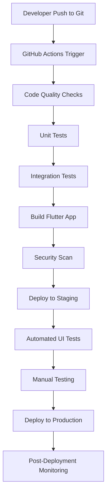

# StudyBuddy DevOps Workflow

## CI/CD Pipeline Overview

## Detailed Workflow Stages

### 1. Development Phase
**Tools:** Flutter SDK, VS Code, Git
**Activities:**
- Feature development
- Bug fixes
- Code reviews
- Local testing

### 2. Code Quality & Testing Phase
**Tools:** GitHub Actions, Flutter Test, Dart Analyzer
**Activities:**
- Static code analysis
- Unit tests execution
- Widget tests
- Integration tests
- Code coverage reporting

**What Gets Tested:**
- Business logic functions
- UI components
- API integrations
- Database operations
- User authentication flows

### 3. Build Phase
**Tools:** Flutter Build, Firebase CLI
**Activities:**
- Compile Flutter app
- Generate APK/IPA files
- Bundle assets
- Optimize performance

**What Gets Built:**
- Android APK
- iOS IPA
- Web build
- Asset bundles

### 4. Security & Quality Assurance
**Tools:** SonarQube, OWASP ZAP
**Activities:**
- Security vulnerability scan
- Code quality metrics
- Performance analysis
- Dependency audit

### 5. Staging Deployment
**Tools:** Firebase App Distribution, TestFlight
**Activities:**
- Deploy to staging environment
- Automated UI testing
- Performance testing
- User acceptance testing

**What Gets Deployed:**
- Staging app builds
- Test data
- Mock services

### 6. Production Deployment
**Tools:** Firebase Hosting, App Store Connect, Google Play Console
**Activities:**
- Production build deployment
- Database migrations
- Feature flags activation
- Monitoring setup

**What Gets Deployed:**
- Production app builds
- Live database
- Production APIs
- CDN assets

### 7. Post-Deployment
**Tools:** Firebase Analytics, Crashlytics, Sentry
**Activities:**
- Performance monitoring
- Error tracking
- User analytics
- Health checks

## Environment Configuration

### Development Environment
- **Database:** SQLite (local)
- **API:** Mock services
- **Authentication:** Development Firebase project
- **Storage:** Local file system

### Staging Environment
- **Database:** Firebase Firestore (staging)
- **API:** Staging backend services
- **Authentication:** Staging Firebase project
- **Storage:** Firebase Storage (staging)

### Production Environment
- **Database:** Firebase Firestore (production)
- **API:** Production backend services
- **Authentication:** Production Firebase project
- **Storage:** Firebase Storage (production)

## Testing Strategy

### Automated Testing
1. **Unit Tests** (Run on every commit)
   - Business logic validation
   - Data model tests
   - Utility function tests

2. **Widget Tests** (Run on every commit)
   - UI component rendering
   - User interaction testing
   - Navigation flow testing

3. **Integration Tests** (Run on staging deployment)
   - End-to-end user flows
   - API integration testing
   - Database operation testing

### Manual Testing
1. **User Acceptance Testing** (Before production)
   - Feature functionality verification
   - Cross-platform compatibility
   - Performance validation

2. **Security Testing** (Before production)
   - Penetration testing
   - Data privacy validation
   - Authentication flow testing

## Deployment Schedule

### Development Deployments
- **Frequency:** Multiple times per day
- **Environment:** Development
- **Purpose:** Feature testing and development

### Staging Deployments
- **Frequency:** Daily
- **Environment:** Staging
- **Purpose:** Integration testing and QA

### Production Deployments
- **Frequency:** Weekly (Sundays)
- **Environment:** Production
- **Purpose:** User-facing releases

## Monitoring & Alerting

### Application Monitoring
- **Performance Metrics:** App startup time, screen load times
- **Error Tracking:** Crash reports, exception logging
- **User Analytics:** Feature usage, user engagement

### Infrastructure Monitoring
- **Server Health:** API response times, database performance
- **Storage Monitoring:** File upload/download success rates
- **Authentication Monitoring:** Login success rates, security events

## Rollback Strategy

### Automatic Rollback Triggers
- High error rate (>5%)
- Performance degradation (>50% slower)
- Security vulnerability detection

### Manual Rollback Process
1. Identify the issue
2. Stop new deployments
3. Rollback to previous stable version
4. Verify system stability
5. Investigate root cause

## Security Measures

### Code Security
- Dependency vulnerability scanning
- Static code analysis
- Secrets management
- Code signing

### Runtime Security
- API authentication
- Data encryption
- Network security
- Access control

## Performance Optimization

### Build Optimization
- Asset compression
- Code splitting
- Tree shaking
- Bundle analysis

### Runtime Optimization
- Image caching
- Lazy loading
- Memory management
- Network optimization 