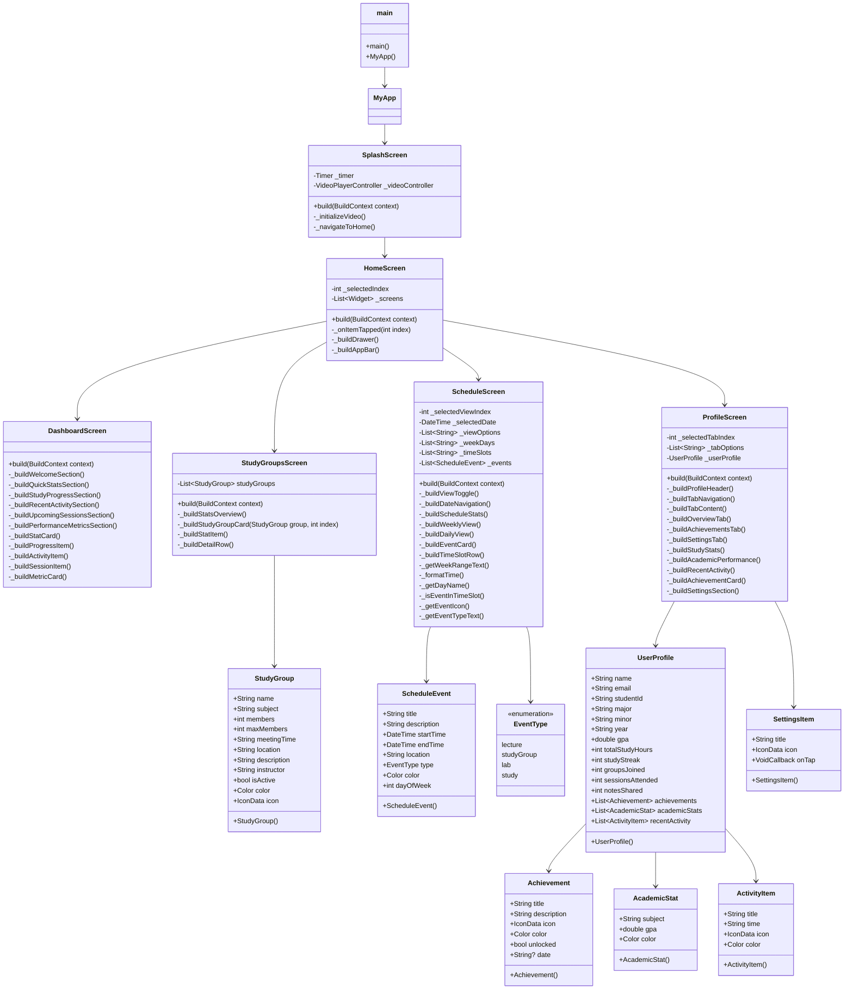
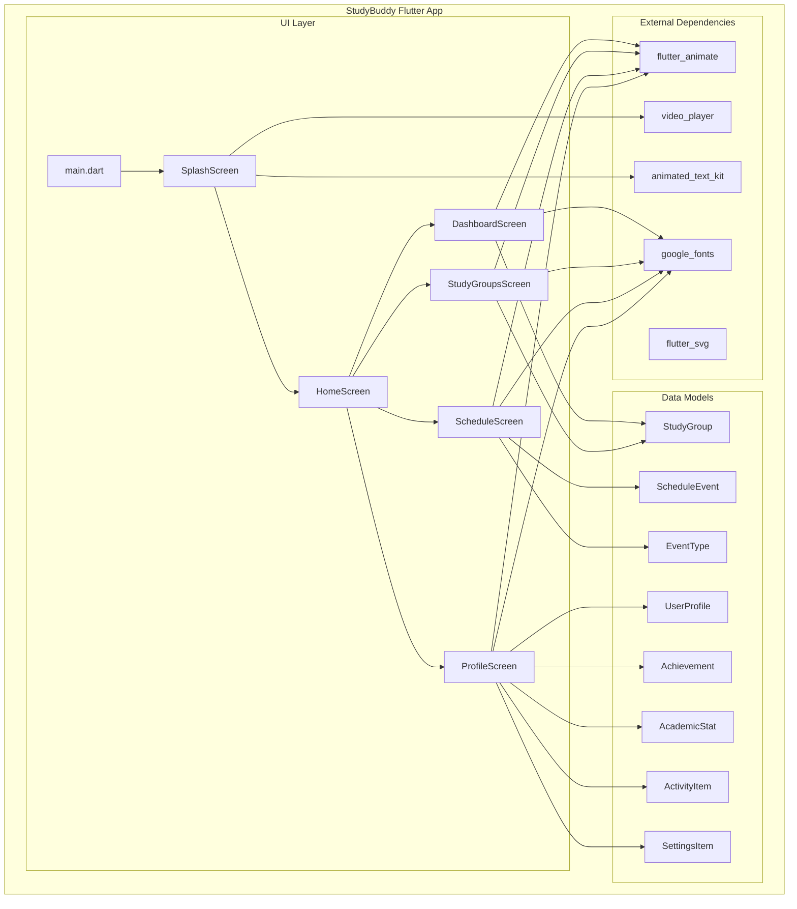
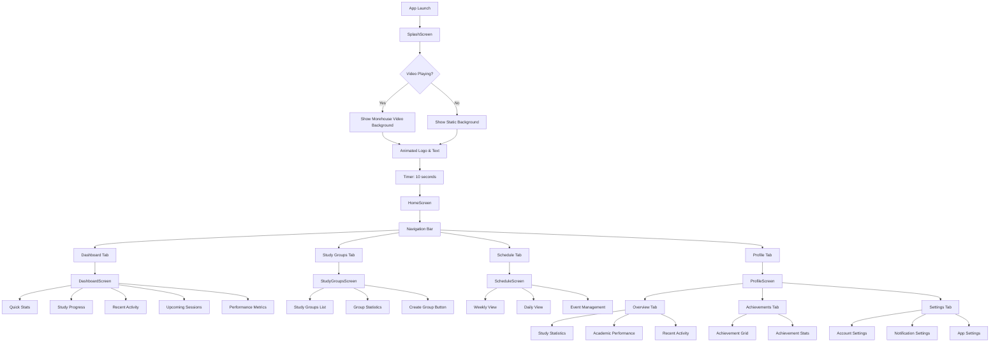
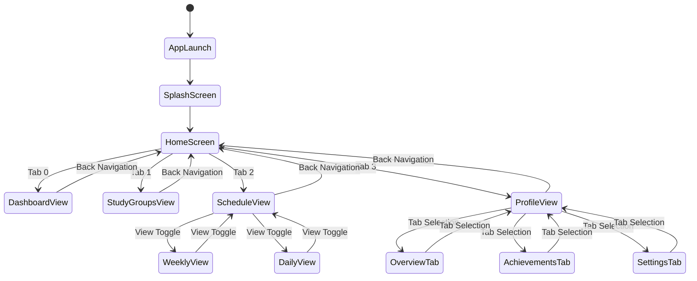

# StudyBuddy Flutter Application - UML Diagram

## Application Architecture Overview

The StudyBuddy Flutter application follows a modular architecture with separate screens for different functionalities, using StatefulWidget for state management and Google Fonts for consistent typography.

## Class Diagram



## Component Diagram



## Navigation Flow Diagram



## State Management Diagram



## Data Flow Diagram

```mermaid
flowchart LR
    subgraph "User Input"
        A[User Interactions]
        B[Tab Navigation]
        C[Button Clicks]
        D[Form Inputs]
    end
    
    subgraph "UI Components"
        E[StatefulWidget]
        F[setState() calls]
        G[Widget Rebuilds]
    end
    
    subgraph "Data Models"
        H[StudyGroup Data]
        I[ScheduleEvent Data]
        J[UserProfile Data]
        K[Achievement Data]
    end
    
    subgraph "External Services"
        L[Google Fonts]
        M[Flutter Animate]
        N[Video Player]
        O[SVG Rendering]
    end
    
    A --> E
    B --> E
    C --> E
    D --> E
    
    E --> F
    F --> G
    G --> E
    
    E --> H
    E --> I
    E --> J
    E --> K
    
    E --> L
    E --> M
    E --> N
    E --> O
```

## Key Design Patterns

### 1. **StatefulWidget Pattern**
- Each screen extends StatefulWidget for local state management
- setState() used for UI updates
- State preserved during navigation

### 2. **Composition Pattern**
- Widgets composed of smaller, reusable components
- Each screen builds its UI from multiple widget methods
- Consistent styling and behavior across components

### 3. **Data Model Pattern**
- Separate data classes for different entities
- Immutable data models with required parameters
- Clear separation between UI and data logic

### 4. **Navigation Pattern**
- Bottom navigation bar for main sections
- Drawer for additional navigation options
- Tab-based navigation within screens

### 5. **Animation Pattern**
- Consistent use of flutter_animate package
- Staggered animations for list items
- Smooth transitions between states

## Architecture Benefits

1. **Modularity**: Each screen is self-contained with its own state
2. **Maintainability**: Clear separation of concerns
3. **Scalability**: Easy to add new screens and features
4. **Consistency**: Unified design language and animations
5. **Performance**: Efficient widget rebuilding and state management

## Dependencies

- **flutter_animate**: For smooth animations and transitions
- **google_fonts**: For consistent typography
- **flutter_svg**: For SVG image rendering
- **video_player**: For video background in splash screen
- **animated_text_kit**: For text animations

This UML diagram provides a comprehensive overview of the StudyBuddy Flutter application's architecture, showing the relationships between components, data flow, and design patterns used throughout the application. 